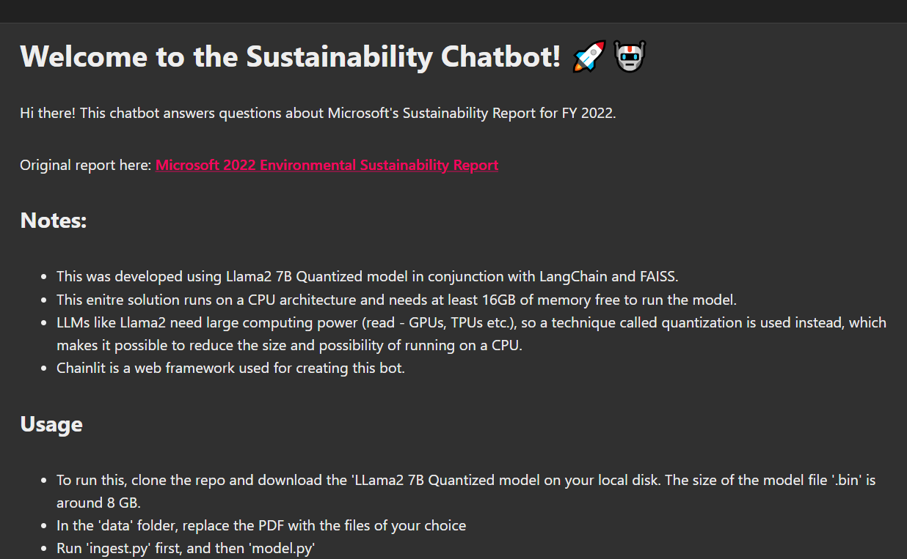

# Welcome to the Sustainability Chatbot! 🚀🤖

Hi there! This chatbot answers questions about Microsoft's Sustainability Report for FY 2022.

Original report here: [Microsoft 2022 Environmental Sustainability Report](https://aka.ms/SustainabilityReport2022)

## Notes:

- This was developed using Llama2 7B Quantized model in conjunction with LangChain and FAISS.
- This enitre solution runs on a CPU architecture and needs at least 16GB of memory free to run the model.
- LLMs like Llama2 need large computing power (read - GPUs, TPUs etc.), so a technique called quantization is used instead, which makes it possible to reduce the size and possibility of running on a CPU.
- Chainlit is a web framework used for creating this bot.

## Usage

- To run this, clone the repo and download the 'LLama2 7B Quantized model on your local disk. The size of the model file '.bin' is around 8 GB.
- In the 'data' folder, replace the PDF with the files of your choice
- Run 'ingest.py' first, and then 'model.py'

## Useful Links 🔗

- [Chainlit Documentation](https://docs.chainlit.io) 📚
- [Llama2 7B Quantized Model- download from here](https://huggingface.co/TheBloke/Llama-2-7B-GGML)
- [LangChain](https://www.langchain.com/)
- [FAISS](https://engineering.fb.com/2017/03/29/data-infrastructure/faiss-a-library-for-efficient-similarity-search/)

## SCreenshots

